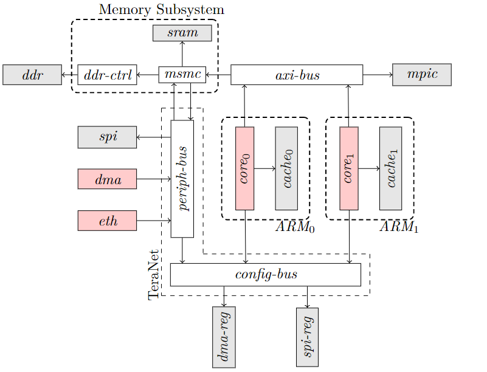
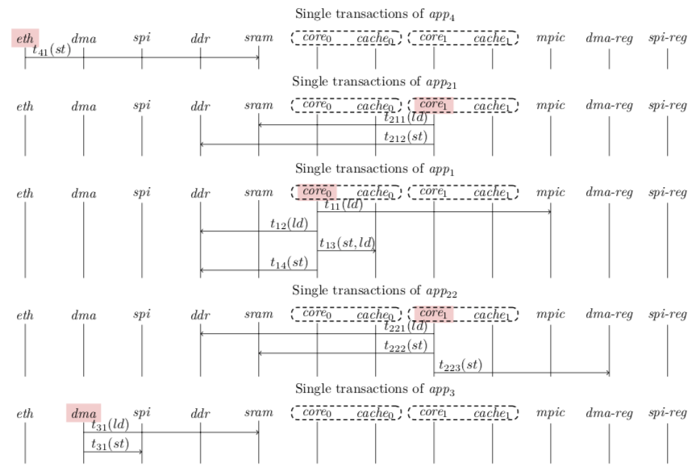
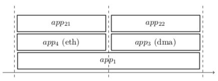

# Documentation for Simple example

## Platform

This processor is composed of:

* two cores,
* one DMA (Direct Access Memory),
* one Ethernet device,
* one DDR and SRAM memory,
* one SPI controller,
* an interrupt controller (MPIC),
* and a set of configuration registers reachable through a specific configuration bus.

As shown in Figure 1 the two core are linked by an
AXI bus. The IO devices (DMA, Ethernet controler and SPI) are
linked through a dedicated peripheral bus. These two buses are
connected to the memory subsystem (containing the DDR and
the SRAM memories) through a dedicated controller
called Memory Shared Multicore Controller (MSMC). This controller
acts as a switch from the two buses to the two memories.

All the resources necessary for executing program instructions are locally hosted by each core: ordinal counter,
registers, computing units, etc.
These resources are private to each core.
They can be used simultaneously without interference by each core.
Conversely, the memory hierarchy is composed of resources local
to each core (the cache memories), and also global
resources (such as DDR and SRAM) simultaneously reachable
by the cores and the IO devices.
These global memories are shared resources.

Figure 1: Multicore processor

PML Encoding is provided in src/main/scala/pml/examples/simpleKeystone/SimpleKeystonePlatform.scala

## Software Allocation

The application layer is composed of five tasks:

* app4 is an asynchronous microcode running on the eth component.
* app21 is a periodic task running on core2.
* app22 is a periodic task running on core2.
* app3 a microcode running on DMA.
* app1 is an asynchronous applicative task running on core1.

PML Encoding is provided in src/main/scala/pml/examples/simple/SimpleSoftwareAllocation.scala

## Transaction library

The application layer is composed of five tasks:

* app4 is an asynchronous microcode running on the Ethernet component.
  Each time an Ethernet frame arrives, it transfers the payload of the frame to SRAM (transaction t41).
* app21 and app22 are two periodic tasks running core1.
*
    * At each period app21 reads the last Ethernet message from SRAM,
      makes some input treatments on the message, and makes it available for app1 in DDR.
*
    * Similarly, at each period app22 reads output data of app1 from DDR. It transforms them into SPI frames.
      The frames are then store in SRAM. And finally app22 wakes up the DMA (app3)
      by writing the address of the SPI frames into the DMA registers.
* app3 is a microcode running on DMA. When woke up, app3 reads the SPI frame from
  SRAM and transfers it to SPI.
* app1 is an asynchronous applicative task running on core0 and activated each time a external interrupt arrives.
  It begins by reading the interrupt code from MPIC (transaction t11).
  It reads its input data from DDR (transaction t12).
  Then it runs using the internal cache of core0 (transaction t13).
  And finally it stores its output data in DDR (transaction t14).

The transactions are drawn in Figure 2.

Figure 2: Transactions of app1, app21 app22, app3,and app4.

By design, app22 and app3 do not run simultaneously, as app22 wakes up app3 at the end of its execution.

PML Encoding is provided in src/main/scala/pml/examples/simple/SimpleTransactionLibrary.scala

In this example all defined transaction are used, the configuration of the library is provided in
src/main/scala/examples/simple/SimpleLibraryConfiguration

## Routing

In this example, as shown in Figure 1, there are multiple paths between the cores and the configuration registers.
These registers can be reached from the core either through AXI-BUS, MSMC, PERIPH-BUS and CONFIG-BUS, or directly
through CONFIG-BUS.
The platform is configured such that the read and store accesses by the core to the configuration registers are routed
through the
the direct path.

The PML routing rules are encoded in src/main/scala/pml/examples/simple/SimpleRoutingConfiguration.scala

## Temporal slices

The tasks are scheduled into two periodic time slices as shown in Figure 3:
app4 and app21 are scheduled in the first time slice;  
app22 and app3 are scheduled in the second time slice;
and as app1 is asynchronous, it can run at any time, that is, possibly in the both slices.

Figure 3: Temporal scheduling.

The footprint of the transactions of these five tasks on the architecture is shown of each time slice in Figure 4.

, app3, and app3).")

Figure 4: Footprint of the transactions on the HW architecture (the red, violet, blue, and green arrows represent
respectively the transactions of app1, app2 (app21, app22), app3, and app3).

The PML encoding of the first time slice is provided in
src/main/scala/pml/examples/simple/SimpleKeystoneLibraryConfigurationPalnApp21.scala,
and the second time slice is provided in
src/main/scala/pml/examples/simple/SimpleKeystoneLibraryConfigurationPalnApp22.scala

## Specifications

In this example we consider that

* bus services are independent
* DMA and dma-reg services impacts each others
* app21 and app22 are exclusive as they run on the same core
* app22 and app3 are exclusive as app22 wakes up app3 at the en of its execution.

PML encoding is provided in src/main/scala/views/interference/examples/simple/SimpleTableBasedInterferenceSpecification

## Exports

### Configured platform

The file src/main/scala/pml/examples/simple/SimpleExport shows how graphical exports are produced (stored in export
folder)
from a platform:

* graph of used SW and HW
* graph of used services per application
* table of transaction
* table of data
* table of SW allocation to HW
* table of component activation
* table of SW usage
* routing table
* transfert table

### Interference analysis

The file src/main/scala/views/interference/examples/SimpleInterferenceGeneration shows how interference analysis can be
performed
on a configured platform. The generated files are stored in analysis folder:

* computation of n-itf
* computation of n-free
* computation of n-channels

As an example the following interference is identified as a 3-itf in the first time slice:

< app1_wr_d2 || app21_wr_d1 || app4_wr_input_d >

")

Figure 5: Example of footprint and interference channel (identified by the two circles) 

