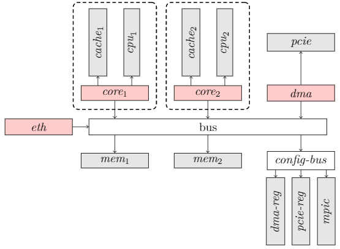

# Documentation for Simple example

## Platform

This processor is composed of:
* two cores, 
* one DMA (Direct Access Memory), 
* one Ethernet device, 
* two memory controllers (the memories behind the memory controllers are not represented),
* one PCIe controller, 
* an interrupt controller (MPCI), 
* and a set of configuration registers reachable through a specific configuration bus.

All the resources necessary for executing program instructions are locally hosted by each core: ordinal counter, registers, computing units, etc. 
These resources are private to each core. 
They can be used simultaneously without interference by each core. 
Conversely, the memory hierarchy is composed of resources local to each core (the cache memories), and two global memories reachable from the two cores. 
These global memories are shared resources.

The cores, the Ethernet device, the DMA, and the memories are connected by a central bus as shown in Figure 1. 
This bus carries transactions, that is, requests from the cores, the Ethernet port, and the DMA to the memories and to the configuration bus. 
As such, the central bus is a shared resource that can be used asynchronously by the transactions. 
These transactions can collide when attempting to cross the bus at the same time.

Figure 1: Multicore processor

PML Encoding is provided in src/main/scala/pml/examples/simple/SimplePlatform.scala

## Software Allocation

The application layer is composed of five tasks:
* app4 is an asynchronous microcode running on the eth component. 
* app21 is a periodic task running on core2. 
* app22 is a periodic task running on core2.
* app3 a microcode running on DMA. 
* app1 is an asynchronous applicative task running on core1.
  
PML Encoding is provided in src/main/scala/pml/examples/simple/SimpleSoftwareAllocation.scala

## Transaction library

The application layer is composed of five tasks:
* app4 Each time an Ethernet frame arrives, it transfers the payload of the frame to mem2 (transaction t41).
* app21 is a periodic task running on core2. At each period app21 reads the last Ethernet message from mem2, makes some input treatments on it, and makes it available for app1 in mem1.
* app22 is a periodic task running on core2. Similarly, at each period app22 reads output data of app1 from mem1. It transforms them into PCIe frames. The frames are then store in mem2.
* app22 wakes up the DMA (app3) by writing the address of the PCIe frames into the DMA registers.
* app3 a microcode running on DMA. When woke up, app3 reads the PCIe frame from mem2 and transfers it to pcie.
* app1 is an asynchronous applicative task running on core1 and activated each time an external interrupt arrives. It begins by reading the interrupt code from mpic (transaction t11). It reads its input data from mem1 (transaction t12). Then it runs using the internal cache of core1(transaction t13). And finally it stores its output data in mem1(transaction t14).

, app3,and app4)")

Figure 2: Transactions of the HW architecture (the red, violet,blue, and green arrows represent respectively the transactions of app1,app2(app21 app22), app3,and app4).

PML Encoding is provided in src/main/scala/pml/examples/simple/SimpleTransactionLibrary.scala

In this example all defined transaction are used, the configuration of the library is provided in src/main/scala/examples/simple/SimpleLibraryConfiguration

## Routing

In this example there are not multiple paths between target and initiators so the routing configuration is optional (here empty)

## Specifications

In this example we consider that 
* bus services are independent
* DMA and config_bus services impacts each others
* app21 and app22 are exclusive

PML encoding is provided in src/main/scala/views/interference/examples/simple/SimpleTableBasedInterferenceSpecification

## Exports

### Configured platform

The file src/main/scala/pml/examples/simple/SimpleExport shows how graphical exports are produced (stored in export folder) 
from a platform:
* graph of used SW and HW
* graph of used services per application
* table of transaction
* table of data
* table of SW allocation to HW
* table of component activation
* table of SW usage
* routing table
* transfert table

### Interference analysis

The file src/main/scala/views/interference/examples/SimpleInterferenceGeneration shows how interference analysis can be performed
on a configured platform. The generated files are stored in analysis folder:
* computation of n-itf
* computation of n-free
* computation of n-channels

As an example the following interference is identified as a 3-itf

< app1_rd_d1 || app21_wr_d1 || app4_wr_input_d >

")

Figure 3: Footprint and interference channel (identified by the two circles) 

